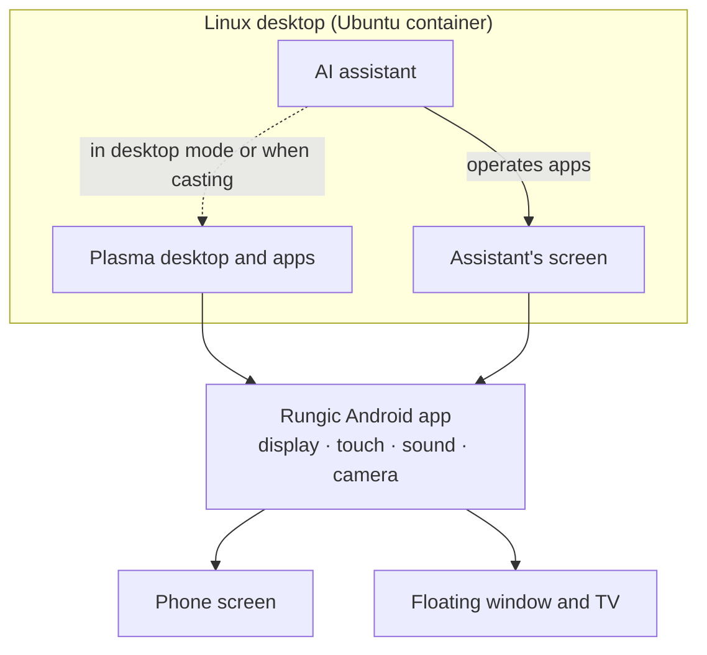

<h1 align="center">Rungic</h1>

<p align="center"><strong>AgentOS in your hand.</strong></p>

<p align="center">A budget-friendly Android phone, a full Linux desktop computer, and an assistant that does the work for you.</p>

<p align="center">
  
</p>

<p align="center"><sub>“Make a little rocket in Blender and render it for me.” The whole task took about 2½ minutes. The animation plays faster.</sub></p>

Rungic turns a compatible Android phone into a Linux desktop computer. It offers a budget-friendly way to use the hardware you already own. It opens the KDE Plasma desktop and runs desktop software such as Firefox, Blender, Krita and VS Code. Connect a TV to use it as a desktop PC.

Rungic includes an AI assistant that can see, speak and act. Tell it what you need. It opens apps and does the work while you watch.

**Rungic supports your choice of agent.** The bundled assistant is a working demonstration and the default implementation. It currently uses Codex. Other agents can use the desktop, phone interfaces and system services independently. Connecting another agent to the bundled assistant's voice, tasks and widgets requires an adapter. There is no universal one-click switch yet.

## Working together

**Once agents become lasting participants in our work, what should the relationship between people and computers look like?**

We imagine persistent workspaces where agents explore, build and learn. People can join the work, understand decisions and discoveries, and discuss what happens. They can take over a step, change direction and return the work to the agent. The aim is to free people's attention for understanding, judgment, learning and creation. Our [Agent OS philosophy](docs/philosophy.md) describes this direction.

## Just say it

<table>
<tr>
<td>

Hold the Home button and ask:

> “Make a little rocket in Blender and render it for me.”
>
> “Install Krita for me.”
>
> “Put your screen on the TV.”
>
> “Send Mom a WeChat voice message: I'll be home for dinner.”

The assistant presents a plan first and speaks its progress updates. It opens apps, clicks buttons and types for you. When the task ends, its pictures and files appear in the conversation. You can open them there.

</td>
<td width="260">

</td>
</tr>
</table>

## The assistant has its own screen

<table>
<tr>
<td width="260">

</td>
<td>

The assistant works on its own desktop. You can continue using your phone.

- Its screen appears in a small floating window. You can resize the window or place it against the screen edge. Ask the assistant to send it to the TV.
- Its clicks and typing stay in that workspace while it works there. You can continue using your phone.
- In desktop mode or while casting to a TV, the assistant works on your desktop with you. You can also tell it where to work.
- Up to four agent workspaces can run at once. Each has its own floating window and sound. You hear a workspace's sound only while its window is visible. The windows stack down the screen so you can watch them all.
- The close button asks the workspace's apps to quit and closes the workspace. An app with unsaved work keeps the workspace open. Rungic tells you when this happens. If an agent is still working there, the button only hides the window. Rungic pauses apps in a hidden, idle workspace and closes it after a long idle period.

</td>
</tr>
</table>

<p align="center">
  
</p>

<p align="center"><sub>The assistant's screen at full size: Blender with the rocket it just built.</sub></p>

## A team of agents

Several agents can work together and share a project folder. Each agent has its own workspace and apps. One Codex agent leads the team. It writes a brief and starts a team member for each part of the work. It collects one round of review, makes decisions and combines the results.

<p align="center">
  
</p>

<p align="center"><sub>The director during a team run on a moto g100s, sped up: art in Krita, sound in Ardour, the game in Godot.</sub></p>

The request was for a small Flappy Bird game. It specified Godot for the game, Krita for the art and Ardour for the sound. The lead agent followed these steps:

1. It wrote a brief that specified pixel art, three short sound effects and touch controls. It started three team members in separate workspaces.
2. It collected one round of review with eight points from the three members. It resolved those points and started the work.
3. The members worked in parallel. The Krita member finished the art after about 7 minutes. The Ardour member finished the effects after about 8 minutes. After about 11 minutes, the Godot member integrated the art and sound. Its gameplay, asset and audio-output checks passed.
4. The lead checked the result. It opened the game, Sunny Flap, on the phone for play.

From the request to a playable game took about 15 minutes.

<p align="center">
  
</p>

<table align="center">
<tr>
<td align="center"><br><sub>All at once: Godot in focus, Krita and Ardour beside it</sub></td>
<td align="center"><br><sub>Then you play</sub></td>
</tr>
</table>

While a team works, its screens appear in a **director** view. The selected screen appears large, with the other screens in a column beside it. Each tile names its member and state. A short ticker describes the agent's activity, such as "Paint and export layered Krita game assets". Reviews, finished deliveries and other milestones from members appear as tags in the same ticker.

Tap a tile to select its screen. The director uses the same layout fullscreen on the phone and when cast to a TV. It appears over a blurred version of the phone's wallpaper.

This run started from a single request through [`tools/team/run-lead.sh`](tools/team/README.md). The conversation does not show team progress or announce handovers yet. The [agent workspaces document](docs/research/91-agent-workspaces.md) records the first team run, which used manual leadership and a written contract. It also records the experiments behind the Codex lead. The document is in Chinese.

## Proactive intelligence: useful suggestions, at your pace

The initial scope is system care. It covers faults that need attention, known software compatibility issues and opportunities to optimize software. Rungic keeps local records of each issue, its evidence, your decision and any investigation or repair task.

1. **Detect issues.** Rungic collects evidence of recent Linux crashes, failed services, incomplete package operations and low storage. It checks installed software against the repository's [compatibility knowledge base](compatibility/README.md). The checks use exact package versions and recorded environment constraints. Rungic preserves intentional settings as policy and does not flag them for optimization.
2. **Show suggestions.** Suggestions appear on the assistant's Suggestions page and in native Plasma home-screen widgets. The widgets preserve the wallpaper, favorite apps and app drawer. Rungic combines repeated evidence for the same issue. Related cards form a stack you can swipe up or down, with separate groups for different issues. Tap a card to open its issue in the app.
3. **Choose when to act.** You can keep an issue for later, set a reminder or dismiss it. Notifications respect system settings that suppress them and avoid repeating progress you already saw. Rungic limits the frequency of ordinary suggestions and waits for a suitable context. Results remain available to revisit.
4. **Investigate before making changes.** Give a suggestion to the agent. Its result explains what happened, what the evidence supports, its confidence in the conclusion and the next steps. It leaves unknown causes unresolved. Repairs require a proposed plan and your confirmation. Approval applies to a specific revision of the plan and evidence, so Rungic cannot silently apply an outdated plan.
5. **Check results and keep history.** Rungic separately records investigation, repair progress, issue status and reminder choices. These records survive service restarts. A completed agent task alone does not prove that the underlying problem is resolved.

   Upstream feedback starts with a local facts bundle and an issue or PR record. External submission requires an explicit request. An upstream merge does not prove that your installed version contains the repair.

A separate **Agent widget** shows the bundled Codex integration's activity and usage with small pixel illustrations. It shows the token usage that the integration observes. It shows account quotas and reset times when the account provides them. It does not invent subscription reset times for accounts that use API keys. Tap the widget to open the assistant or usage details. Another agent must supply its own usage data to support this widget.

Rungic implements these system-care features within the scope described above. Rungic does not yet detect every Android fault or automatically determine whether every app uses hardware acceleration. Compatibility suggestions depend on reviewed knowledge entries. Automatic upstream PR submission and status synchronization remain unimplemented. The [implementation and acceptance record](docs/research/proactive-system-care.md) distinguishes behavior tested on devices from remaining work.

## You stay in control

- **It asks first.** Before it closes an app you are using, deletes or overwrites your files, or sends a message, it asks you.
- **Your password stays yours.** When an action needs administrator rights, the system shows a password dialog on your screen. You type the password. The assistant never sees it.
- **You choose how to continue.** If the plan cannot proceed, the assistant explains the options and their consequences. You choose the next step. It does not silently reduce the scope of the result.
- **You set the rules.** The assistant's guidelines and skills are plain text files in your home folder. Changes to these files apply immediately.

These rules describe the bundled assistant's workflow. Its separate desktop isolates the work session's display and input. It shares your Linux account and files. The agent follows instructions to ask first. Administrator authentication uses the system's authorization dialog. A replacement agent needs corresponding policies and integration.

## A real computer in your pocket

- **A complete Linux desktop.** Ubuntu 26.04 with KDE Plasma Mobile 6.6. Install software with apt, Flatpak or the Discover app store.
- **GPU acceleration.** The desktop, browser and 3D software use the phone's GPU. This includes older X11 programs and Flatpak apps. Video decoding uses hardware acceleration.
- **Your phone's hardware.** Use the speaker, microphone, front and rear cameras, and a clipboard shared with Android. Rime provides Chinese input.
- **Desktop mode and casting.** Open the full desktop in a floating window. You can also cast it wirelessly to a TV. Use the phone as the TV desktop's touchpad and keyboard.
- **Display performance.** Frames pass directly to the display without copying. Refresh rates reach up to 120 Hz while you touch the screen.
- **System care.** Home-screen suggestions show faults and known compatibility issues. You can investigate and address them when convenient.

<table>
<tr>
<td align="center"><br><sub>Desktop apps on the phone</sub></td>
<td align="center"><br><sub>Desktop mode in a floating window</sub></td>
</tr>
</table>

<p align="center">
  
</p>

<p align="center"><sub>The same desktop on a TV or in the floating window.</sub></p>

## Still your Android phone

Rungic opens as an Android app after device preparation. Preparation starts with the manufacturer's original firmware for the exact model and version. It requires a matching GKI kernel rebuilt for LXC. Our delivery direction separates device preparation from RungicOS installation. Once the Android base is compatible, Rungic can be built and updated independently. Android remains the phone's operating system alongside the Linux desktop.

After installation, account setup and device checks finish, tap the Rungic icon to open the desktop. Return to Android to use your phone. Both environments run together and share the clipboard, photos, videos and downloads.

**Bootloader unlocking or the required device-preparation procedure can erase user data.** Separate Rungic installation keeps the Android base and its data. Testing on the moto X70 Air Pro confirmed this behavior with a developer USB installer. See [Choose what to build and install](#choose-what-to-build-and-install). Make a backup before starting. Read [Before you install](#before-you-install) for app and manufacturer restrictions.

## How it works



Rungic does not replace the phone's operating system. Android continues to handle calls, networking, the camera and other hardware. The Linux desktop runs in a container. The Rungic app connects its display, touch input, sound and camera to Android.

The bundled assistant has two parts. A realtime voice model talks with you. Codex runs tasks in the background. This is the reference integration. Other agents can reuse the system capabilities described below.

## Performance

**Linux programs run at the phone's native CPU speed.** The desktop runs in an LXC container on Android's Linux kernel. Ubuntu's ARM64 programs run directly on the phone's CPU cores. The same kernel schedules them alongside Android apps. There is no virtual machine, emulator or instruction translation.

The container gives Linux programs their own namespaces for files, processes and users, plus resource groups. Their display, touch input, sound and camera use the Rungic app. Their computation runs as it does on other ARM64 Linux machines.

Geekbench 7 ran once as an Android app and once in Rungic's Linux desktop on the same moto g100s. See the [comparison](https://browser.geekbench.com/v7/cpu/compare/511001?baseline=515585).

| Geekbench 7 CPU | Android ([511001](https://browser.geekbench.com/v7/cpu/511001)) | Rungic, Ubuntu 26.04 in the container ([515585](https://browser.geekbench.com/v7/cpu/515585)) | Rungic vs Android |
|---|---:|---:|---:|
| Single-core | 820 | 814 | 99% |
| Multi-core | 2485 | 2563 | 103% |

- **Same processor.** Both runs report a Snapdragon SM6435 CPU with 8 cores and processor ID part 3393. Both report 7.3 GB of memory. Geekbench names the phone "moto g57 power" on Android and "mumba", its codename, on Linux.
- **Individual workloads.**
  - Single-core: the 16 workloads score between 88% and 111% of Android's results. Rungic scores higher in Video Encoder (+11%), Audio Encoder (+10%) and Photo Library (+9%). It scores lower in Asset Compression (−13%), Ray Tracer (−12%) and HDR (−8%).
  - Multi-core: six of the eight workloads score within ±7% of Android's results. Text Processing scores 2.6× Android's result (2998 against 1165). Photo Editor scores 58% of Android's result (974 against 1678). These differences remain uninvestigated.
- **Limits of the comparison.** Each environment ran the benchmark once. Android used Geekbench 7.1.0 and bionic. Linux used Geekbench 7.0.0 Preview and Ubuntu's glibc. These builds and system libraries differ. Treat the overall result as similar performance, not a performance gain.

All scores for individual workloads are in [`benchmarks/geekbench7-cpu-20261001`](benchmarks/geekbench7-cpu-20261001/results.json). Graphics use the phone's GPU through Mesa. The [benchmark notes](benchmarks/README.md) contain display and renderer measurements.

## What makes it Agent Ready

Rungic gives agents workspaces, tools, evidence and a way to deliver results. These system capabilities support different agents.

| What the system provides | What an agent can do | What you get |
|---|---|---|
| **A real Linux environment** | Run code and command-line tools. Work with files. Install desktop software through the package system. | Finished documents, images, projects and installed apps |
| **Desktop control** | Start apps, inspect windows, take screenshots, click and type through desktop MCP tools. | Work in existing graphical apps, including apps without an agent-specific integration |
| **An agent workspace** | Work on a separate desktop, or use your desktop when requested | A visible work session that can run alongside your own |
| **Phone and desktop interfaces** | Read device state. Change brightness, use the shared clipboard and control casting through structured commands. | Tasks that connect desktop software with the phone and its display |
| **Diagnostics and compatibility knowledge** | Inspect available logs and crash evidence. Check installed versions against known issues. Propose a repair with a defined scope. | An explanation based on this device's evidence and software versions |
| **Persistent suggestions and task state** | Investigate an issue. Report investigation and repair progress. Record the outcome. | Problems you can revisit and results you can review |

The bundled assistant connects these capabilities. It turns a request into a plan, visible actions, progress updates and files you can open from the conversation. Diagnostic MCP tools and the repository's build and installation skills also support development agents. Assistance on the phone and device management from a development computer require different access.

Agent and model choices are independent of these system capabilities. A replacement agent can use Linux tools and supported MCP, command-line and D-Bus interfaces. Its integration must provide execution, conversation and authorization behavior. The [integration map](docs/README.md#integrating-another-agent) lists reusable interfaces and the parts currently connected to Codex.

### Interfaces an agent can use

Rungic exposes two **MCP (Model Context Protocol) servers**, command-line tools, D-Bus services and standard Linux interfaces. MCP provides one way to connect an agent. These capabilities do not require Codex.

| Interface | Entry point | What it exposes |
|---|---|---|
| **Desktop MCP** · on the phone | `rungic-cua mcp` | Screenshots, pointer and keyboard actions, app startup, window management, whole-task execution and voice messages. Workspace routing adds `desktop_where` and `desktop_close_workspace`. Available tools depend on the selected execution mode. |
| **Development MCP** · on the development computer | [`tools/rungic_agent_mcp.py`](tools/rungic_agent_mcp.py), configured in [`.mcp.json`](.mcp.json) | Device and renderer state, merged Android/Linux/kernel logs, crash reports, symbolization, integrity checks and evidence bundles. Screenshots, UI inspection and actions, performance traces and build status. Requires separately configured device access. |
| **Phone control** · CLI + JSON | `rungic-platform --request '<json>'` | Device, network and display state. Brightness, clipboard, orientation, vibration and Android settings panels. |
| **Workspaces and displays** · CLI + JSON | `rungic-workspace-env`, `rungic-user`, `rungic-agent-screen`, `rungic-desktop-mode`, `rungic-cast` | Run in a selected desktop session. Show floating windows for one or several workspaces. Close a workspace. Control desktop mode, discover and connect TVs, and inspect casting capabilities. |
| **Proactive system care** · D-Bus + CLI | `com.rungic.Suggestions`, `rungic-suggestions` | Issue/evidence queries, compatibility knowledge, reminders, investigation results, repair plans and local upstream-feedback material. Task handoff currently targets the bundled assistant. |
| **Tasks, voice and usage** · D-Bus | `com.rungic.VoiceAgent`, plus usage methods and signals from the suggestion service | Conversations, task progress and stopping, voice and call controls, observed tokens and quotas from the provider. Replacing the bundled agent requires adapting this bridge and its usage data. |
| **Files, packages and hardware** · Linux interfaces | Shell/files, PackageKit/`pkgcli`, polkit, Wayland, desktop portals, AT-SPI, PipeWire/PulseAudio and Android-backed D-Bus services | Work with files, install software with system authorization, and use the same desktop/media/device interfaces as ordinary Linux apps. Android-backed services implement documented subsets. |

The [Agent Ready interface reference](docs/agent-ready-interfaces.md) lists MCP startup examples, tools, D-Bus methods, session requirements and integration limits. Screenshot and action tools can use the connecting agent's own reasoning. The bundled `desktop_goal` helper uses its own configured model backend. Separating display and input does not isolate the agent from files owned by the same Linux user.

## Integrations

**Bring your agent, keep your workflow.** Rungic can provide the Linux desktop, apps, files and phone interfaces. Another project can provide conversations, an agent runtime or a collaboration space. You can use that project's Android or web client alongside Rungic. You can also connect its execution tools to the Rungic desktop.

The following paths describe possible integrations. The four combinations still need end-to-end validation on Rungic.

| Project | What it brings | How to combine it with Rungic |
|---|---|---|
| [Lorca](https://github.com/egoist/lorca) | Encrypted agent conversations, bot orchestration and paired devices | Use its Android client to talk to a paired runner. A further integration could run its Linux CLI inside Rungic and give bots access to desktop tools. Lorca's phone client is not itself a runner. |
| [OpenMuse](https://github.com/CopilotKit/openmuse) | A personal-agent app built with CopilotKit and AG-UI, with visible tasks, browser work and files | Use its Android or web UI alongside Rungic. A tool adapter could extend its agent workflows to Rungic's graphical apps and local files. Its existing browser and terminal workspace uses a separate backend. |
| [OpenClaw](https://openclaw.ai/) | A personal assistant reachable through messaging apps, with tools and skills | Connect its runtime to Rungic's desktop MCP. Wrap phone commands in a skill or tool. Requests from your preferred chat could then control the phone's Linux desktop. See its [MCP integration documentation](https://docs.openclaw.ai/tools/mcp). |
| [Raft](https://github.com/botiverse/raft-source) | A shared workspace where people and persistent agents collaborate through channels, threads and tasks | Use its web client on Rungic. Integrating its machine daemon/computer runtime could make Rungic an execution machine for workspace agents, with access to local apps and project files. |

Before running an agent locally, check its ARM64 dependencies and runtime requirements. An agent running elsewhere needs a bridge to Rungic's local tools. The desktop MCP currently uses stdio. Showing another agent's progress, suggestions and usage in Rungic's assistant and widgets requires a separate adapter. Read the [system interface reference](docs/agent-ready-interfaces.md) and [agent integration map](docs/README.md#integrating-another-agent).

## Status

Rungic is under active development and in private preview. Current limits and ongoing work include:

- The interface uses the desktop's language, currently English or Chinese. The assistant answers in the language you speak to it. Account setup and some technical documents are still in Chinese.
- Larger tasks, such as 3D modelling, take the assistant about two minutes. Work to reduce this time continues.
- Testing continues on the call agent, which makes and answers phone calls for you.
- Vulkan desktop rendering flickers on this GPU family, so the desktop uses OpenGL ES for now.

## Supported devices

Rungic's architecture supports adaptation to different phones. The Linux desktop runs in an LXC container that shares Android's kernel. The Rungic app uses Android interfaces for the display, touch input, sound and cameras.

For each device, we pin kernel sources and a build configuration that match its stock firmware. We enable missing container capabilities, including System V IPC, POSIX message queues, IPC/PID/user namespaces and devtmpfs. To retain the manufacturer's drivers, we check the rebuilt kernel's module ABI and signature trust, then test on the device.

Full flash packages also include root, the Rungic app and first-boot installation. The device's release manifest records their partition changes.

The current adaptation path requires:

- **An unlockable bootloader and a supported root setup.** Current device integrations use Magisk. Eligibility and consequences depend on the manufacturer and device variant.
- **A GKI kernel with matching sources and compatible vendor modules.** Builds so far use android15-6.6 and android16-6.12. Other branches require adaptation and checks. The Android version alone does not establish compatibility.
- **A Snapdragon chip with an Adreno GPU**, for the hardware-accelerated desktop (Mesa's Turnip and freedreno on Adreno's KGSL driver). Phones with other GPUs need their own graphics work first.
- **ARM64 and enough free storage** for the Linux system.

Each new phone or firmware needs a kernel built from its exact sources. It also needs device checks. The [`rungic-three-stage-image`](.agents/skills/rungic-three-stage-image/SKILL.md) skill guides this work.

Tested so far:

| Device | Kernel | Status |
|---|---|---|
| moto g100s (XT2537-4) | android15-6.6 | Main development device, most complete |
| moto g100 (XT2533-4) | android15-6.6 | One-step flash package verified on a wiped phone |
| moto X70 Air Pro | android16-6.12 | Standalone installation verified after reflashing and wiping stock Android. Rungic installed from scratch. Three cold reboots and nine device checks passed. |

### Before you install

1. **Make a complete backup outside the phone.** The previously validated full-flash path erases user data. Bootloader unlocking normally triggers a [factory reset](https://source.android.com/docs/core/architecture/bootloader/locking_unlocking). Back up photos, files, contacts and messages. Export app-specific data. Make sure you can restore access to your accounts.

   Device preparation and Rungic installation are separate operations. Retaining the manufacturer's Android base does not preserve your data during unlocking or a firmware reset.

2. **Retaining normal Android functionality is a design goal.** Calls, messages, networking, cameras and other phone functions should remain available alongside RungicOS after adaptation and validation. This goal does not guarantee those functions on every phone or firmware. Check the device's acceptance record and release notes. Check which preinstalled apps its firmware profile removes or disables.
3. **Some apps may reject the modified device.** Apps or their services can check root, bootloader state or device integrity. They can restrict access even when Android itself works normally. For example, [Play Integrity](https://developer.android.com/google/play/integrity/overview) lets developers apply their own access policies.

   The app or service imposes these restrictions. Rungic cannot guarantee that every app will accept the device. Other app failures still need diagnosis before attributing them to security policies.

4. **Research the manufacturer's policies for your exact model and variant.** Before unlocking or rooting, check eligibility and the required procedure. Check whether protected features or update support will change. Some effects can persist after restoring stock firmware. For example, [Samsung's Knox documentation](https://docs.samsungknox.com/admin/knox-platform-for-enterprise/faq/) describes restrictions on Knox-dependent services after its Warranty Bit is tripped.

   This example applies to that manufacturer's policies. It does not establish Rungic support for Samsung devices.

## Skills

Skills are reusable instructions that an agent reads to complete a task. Rungic provides three project skills:

| Skill | Where to use it | What it does |
|---|---|---|
| [`rungic-three-stage-image`](.agents/skills/rungic-three-stage-image/SKILL.md) | Codex working in this repository | Guides device/GKI preparation, independent RungicOS image builds, and separate Rungic installation or upgrades. Covers existing tools, implementation gaps and acceptance. |
| [`rungic-dev-release`](.agents/skills/rungic-dev-release/SKILL.md) | Codex or Claude Code working in this repository | Deploys changes through a visible, reversible development overlay (`tools/rungic_dev.py`) or a formal release. Formal releases follow commit, package build, release, deploy and acceptance steps. Covers screenshots of UI states for interface changes. |
| [`rungic-phone-desktop`](agent/assistant/skills/rungic-phone-desktop/SKILL.md) | The assistant running on the phone | Operates desktop apps and windows, controls phone functions, casts to a TV and handles supported call workflows. |

The desktop skill ships with the bundled assistant. Its editable copy lives at `~/.codex/skills/rungic-phone-desktop/` on the phone. Package updates preserve your changes to that copy. These locations and invocation examples describe the current Codex integration. Claude Code finds linked repository skills through `.claude/skills/`. Other agents can reuse the instructions and tools by adapting skill loading to their own format.

### Choose what to build and install

Invoke `$rungic-three-stage-image` in Codex from the repository root. Specify the device and firmware [spec](profiles/devices/). Describe the work and state whether it includes installation. The skill supports the full workflow or a selected stage:

| Your goal | Build scope and output | Installation path |
|---|---|---|
| **Prepare a phone for Rungic** | **CI1:** the spec's pinned GKI/boot, required Android-base preparation and recovery artifacts, and ABI/module-trust reports. | Use the device's verified preparation procedure. Reuse an already compatible base. Repeat preparation only when its requirements change. |
| **Build the Linux system image** | **CI2:** install a selected package release in a clean ARM64 root tree. Produce an ext4 rootfs, compressed payload, package lock and report. | Deliver independently of Android firmware. Use the standalone installer below. Existing installations can use package updates. |
| **Install or upgrade Rungic separately** | **CI3 target:** combine verified rootfs, APK and required host runtime with version/protocol checks and an installer. No Android partition images in the normal Rungic payload. | Install on a compatible prepared phone over USB with [`standalone.py`](tools/ci/standalone.py): `pack`, `verify`, `install` and `status`, given the exact serial, ADB port and trusted manifest digest. It refuses a phone that already has Rungic. Upgrading an installed system by replacing its rootfs, and an installer for end users, are not implemented yet. |
| **Update desktop or Agent components on an installed phone** | Build the changed packages and a versioned APT release. Keep the compatible kernel and Android base. | Deploy through [`rungic_release.py`](tools/rungic_release.py). Reload affected services and UI. Run the relevant acceptance checks. |

Example requests for Codex — replace the placeholders with your chosen inputs:

```text
Use $rungic-three-stage-image to run CI1 only for <device-spec>.
Build the kernel/boot candidate and check its OEM module compatibility.

Use $rungic-three-stage-image to run CI2 only for <device-spec>, using
<package-release>. Produce a clean RungicOS rootfs image and package lock.

Use $rungic-three-stage-image to run CI3 for <device-spec> with
<verified-rootfs-artifacts>: pack and verify the standalone payload, then
install it on <device-serial> and run the first-install acceptance.
```

For installation, name the exact artifact and target device serial. State whether the task is a first installation or an upgrade. A build request produces artifacts. It does not flash the phone. Rungic installation should preserve the existing Android base and user data. Any necessary bootloader or firmware work belongs to the separate device-preparation step.

The Linux rootfs is a container filesystem image that shares Android's kernel. It is not an Android `system.img`.

For incremental work, request a package update. For example: “Build and deploy the updated suggestion widget to my existing Rungic installation on `<device-serial>`. Then verify its desktop interactions.” Project packages use [`rungic_package.py`](tools/rungic_package.py). Modified upstream packages use [`build_on_device.py`](tools/build_on_device.py).

These build and installation skills guide the existing tools. The complete process still needs several tools and device-specific inputs. In particular, [`build_rootfs_image.py`](tools/ci/build_rootfs_image.py) packages an already prepared root tree and checks its package versions. The [current delivery contract](docs/75-image-build-separation.md#2026-09-30rungic-独立安装的三段式目标) separates device preparation from Rungic installation.

Use these guides for the relevant stage:

- The [tool map](.agents/skills/rungic-three-stage-image/references/tool-map.md) lists stage entry points.
- The [new-device guide](.agents/skills/rungic-three-stage-image/references/device-onboarding.md) covers adaptation.
- The [first-boot guide](.agents/skills/rungic-three-stage-image/references/first-boot.md) covers installation and recovery.

The X70 Air Pro records cover standalone installation in three conditions:

- [91](docs/91-x70-independent-install.md): installation on a reused Android base.
- [92](docs/92-x70-android-base-end-to-end.md): installation after reflashing and wiping Android.
- [93](docs/93-x70-independent-image-revalidation.md): a rebuilt image that passed three cold reboots.

The [G100 acceptance record](docs/80-g100-image-installation-retrospective.md) documents the older full-flash path. Legacy full-flash tools remain for explicitly selected recovery or reproduction work. These detailed engineering guides are currently in Chinese.

## Learn more

- [Source layout](docs/README.md#repository-layout): Android host, agents, desktop integration, system services, package definitions and upstream patches
- [Developer guide and documentation index](docs/README.md): repository layout, development entry points, and the design and acceptance documents for each capability
- [Integrating another agent](docs/README.md#integrating-another-agent) · [Proactive system care](docs/research/proactive-system-care.md) · [Compatibility knowledge](compatibility/README.md)
- [Voice assistant](docs/59-voice-agent.md) · [Computer use](docs/60-computer-use.md) · [Assistant's screen](docs/65-agent-screen.md) · [Agent workspaces and teams](docs/research/91-agent-workspaces.md) · [Standalone install on X70](docs/93-x70-independent-image-revalidation.md) · [Development deploys](docs/97-local-development-deploy.md) (in Chinese)
- [Engineering conventions](AGENTS.md) (in Chinese)
